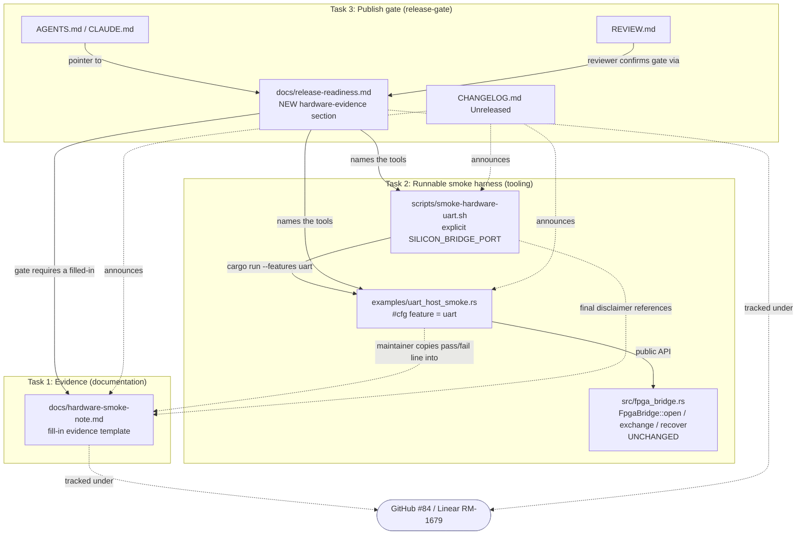

# Design Document: hardware-publish-gate

Tracking: Linear RM-1679 / GitHub [#84](https://github.com/rmems/silicon-bridge/issues/84).
Repo: `silicon-bridge` (Rust crate). Companion: `silicon-hdl`.

## Overview

`hardware-publish-gate` converts the externally-tracked #84 deferral ("a
silicon-bridge UART host session on Basys 3 gates the 0.3.1 publish") into an
**in-repo publish gate**. Today the gate exists only as prose scattered across
README, `docs/consumer.md`, and `docs/release-readiness.md` that points at an
issue. This feature makes the gate *actionable and recorded*: a filled-in
evidence note, a runnable smoke harness that exercises the real public UART
API against a maintainer-selected port, and a formal step in the release
checklist that blocks the authorized `cargo publish` until that note records a
passing session plus an explicit maintainer go-ahead.

This is a **documentation + tooling + release-gate** feature. It adds one
example binary, one shell script, one evidence note, and edits to existing
docs. It makes **no changes to `src/` library logic** — the example is a thin
consumer of the already-public `FpgaBridge` surface, and the script is modeled
on the existing `scripts/smoke-packaged-consumer.sh`. The design deliberately
preserves the house rule that the *ordinary* checklist never flashes an FPGA:
the new gate is a separate, maintainer-run hardware step.

The design honors the crate's hedged-wording house style throughout. It
distinguishes "proves a live silicon-bridge UART host session on one named
board" from what it does **not** prove (multi-board support, timing closure,
crates.io/docs.rs state), and keeps the LED-heartbeat smoke (silicon-hdl #68)
strictly separate from a UART host session. No document is permitted to claim
the hardware proof exists until the evidence note is filled in.

## Architecture

The feature spans three artifact groups mapped to the three CodeRabbit tasks.
There is no runtime coupling between them; the coupling is *documentary and
procedural* — each artifact references the others so a maintainer can move from
"run the harness" to "record the note" to "clear the gate" without leaving the
repo.



### Data / evidence flow (what "recording a session" means)

The evidence chain the note documents runs in this order. This is the flow the
note must describe and the flow the harness partially automates (only the final
host-session step is in this repo).

```mermaid
sequenceDiagram
    participant Params as f32 parameters
    participant SB as silicon-bridge<br/>write_generic
    participant HDL as silicon-hdl<br/>$readmemh banks
    participant BIT as bitstream (Vivado)
    participant BOARD as Basys 3 board
    participant HOST as uart_host_smoke.rs<br/>(uart feature)

    Params->>SB: from_params(...)
    SB->>HDL: parameters*.mem banks (generic-dense-q88)
    HDL->>BIT: synthesize + implement (spikenaut_soc_basys3_top)
    BIT->>BOARD: flash bitstream (maintainer, out of this repo)
    Note over HOST,BOARD: maintainer supplies explicit serial port
    HOST->>BOARD: FpgaBridge::open(port) + one exchange()
    BOARD-->>HOST: 36-byte v3 response (or I/O failure)
    HOST->>HOST: check is_transport_open / needs_recovery;<br/>recover() on failure
    HOST-->>HOST: print scoped status + PASS/FAIL line
    Note over HOST: maintainer pastes PASS/FAIL line into<br/>docs/hardware-smoke-note.md, links raw logs to #84
```

Only the last two participants (`uart_host_smoke.rs` ↔ Basys 3 over the
maintainer's port) are executed inside this repo. Everything left of the board
(export → banks → bitstream → flash) is described by the note but performed by
the maintainer with silicon-hdl + Vivado.

### Boundary and scope guarantees

These are architectural invariants the artifacts must uphold (see Correctness
Properties for the testable form):

- **No auto-probe.** The harness and script obtain the serial port from an
  explicit source only (env `SILICON_BRIDGE_PORT` or CLI arg). They never
  enumerate or guess. `FpgaBridge::new()`/`find_fpga_ports()` (the legacy probe
  helpers) are **not** used.
- **Out of default CI and out of §4.** The example is `#[cfg(feature = "uart")]`
  and the script is invoked only by a maintainer by hand. Neither is wired into
  any `.github/workflows/*` default job, and the script is **not** referenced
  from release-readiness §4 (the ordinary checklist).
- **No premature proof claim.** Every doc edit is written in the conditional /
  "recorded here when filled in" voice until the note actually records a pass.
- **Hedged wording preserved.** Existing hedged sentences in README and
  `consumer.md` are kept; new sentences add an evidence pointer, they do not
  soften or remove hedges.
- **SPDX headers.** New markdown gets `<!-- SPDX-License-Identifier: MIT OR
  Apache-2.0 -->`; the new shell script gets `# SPDX-License-Identifier: MIT OR
  Apache-2.0`.

## Components and Interfaces

### Component 1: Evidence note — `docs/hardware-smoke-note.md` (Task 1, NEW)

**Purpose**: A fill-in template that becomes the single recorded proof of a
silicon-bridge UART host session on the reference board. Empty until a session
is run; when filled in, it is the artifact the publish gate checks.

**Responsibilities**:
- Capture the exact reference hardware identity (Basys 3, `XC7A35T-1CPG236C`,
  `xc7a35tcpg236-1`, silicon-hdl top `spikenaut_soc_basys3_top`).
- Capture reproducibility fields: silicon-bridge HEAD SHA, silicon-hdl HEAD SHA,
  serial port, baud rate, exact commands run, and pass/fail result.
- Describe the `write_generic` → `$readmemh` banks → bitstream → `uart`-feature
  host session flow in order.
- Carry the two-part `## What this proves` / "This does not prove" structure
  matching the `docs/host-hdl-contract.md` convention.
- Reference #84 as the tracking issue and note that raw logs may be linked there.

**Interface (document structure — headings and required fields)**:

```markdown
<!-- SPDX-License-Identifier: MIT OR Apache-2.0 -->

# Basys 3 UART host-session smoke note

<one-paragraph scope: a live silicon-bridge UART host session on ONE named
board; tracked under #84; NOT yet recorded / recorded on <date>>

## Reference hardware
| Field | Value |
|---|---|
| Board | Digilent Basys 3 |
| FPGA | Xilinx Artix-7 XC7A35T-1CPG236C (xc7a35tcpg236-1) |
| silicon-hdl top | spikenaut_soc_basys3_top |

## Session record  (fill in when run)
| Field | Value |
|---|---|
| silicon-bridge HEAD SHA | _<sha>_ |
| silicon-hdl HEAD SHA | _<sha>_ |
| Serial port | _<e.g. /dev/ttyUSB0>_ |
| Baud rate | _<e.g. 115200>_ |
| Exact commands run | _<copied verbatim>_ |
| Result | _PASS / FAIL_ |

## Flow (in order)
1. `write_generic` (or agreed profile) → silicon-hdl `$readmemh` banks
2. banks → bitstream (Vivado, spikenaut_soc_basys3_top)
3. bitstream exercised by a `uart`-feature UART host session on an explicit port

## What this proves
- A live silicon-bridge UART host session on the one named Basys 3 board.

This does not prove:
- multi-board support;
- timing closure;
- crates.io / docs.rs registry state;
- (LED heartbeat smoke silicon-hdl #68 is NOT a UART host session).

## Tracking
GitHub #84. Raw logs may also be linked on that issue.
```

### Component 2: Smoke harness example — `examples/uart_host_smoke.rs` (Task 2, NEW)

**Purpose**: A runnable, `uart`-gated consumer of the public `FpgaBridge`
surface that performs exactly one host exchange against a maintainer-supplied
port and prints a copy-pasteable PASS/FAIL line.

**Consumed public interface** (from `src/fpga_bridge.rs`, all pre-existing and
unchanged):

```rust
// feature = "uart"
impl FpgaBridge {
    pub fn open(port_name: &str) -> Result<Self, SerialError>;
    pub fn builder(port_name: impl Into<String>) -> FpgaBridgeBuilder;
    pub fn exchange(&mut self, layout: &DenseQ88Layout, stimuli: &[f32])
        -> Result<StimulusResponse, ExchangeError>;
    pub fn process_stimuli(&mut self, stimuli: &[f32])
        -> Result<(Vec<f32>, Vec<bool>), ExchangeError>;
    pub fn is_transport_open(&self) -> bool;
    pub fn needs_recovery(&self) -> bool;
    pub fn recover(&mut self) -> Result<(), ExchangeError>;
    pub fn from_port(port: Box<dyn SerialPort>) -> Self; // used only by tests
}
// DenseQ88Layout::silicon_bridge_v3()  (16 in / 16 out; 33 tx / 36 rx bytes)
```

**Responsibilities**:
- Resolve the port from an explicit source **only**: env `SILICON_BRIDGE_PORT`
  or a CLI argument. If neither is present, print guidance and exit non-zero.
  No enumeration, no auto-probe.
- Open the port (`FpgaBridge::open` or `FpgaBridgeBuilder`), run one
  `exchange` (v3 layout) / `process_stimuli` call.
- Inspect `is_transport_open` / `needs_recovery`; on I/O failure call
  `recover()` and report FAIL.
- Emit scoped status lines and a single clear PASS/FAIL line for the maintainer
  to copy into `docs/hardware-smoke-note.md`.
- Follow the MockPort-based offline-testability pattern already in
  `src/fpga_bridge.rs` (i.e., keep the exchange/report logic factored so it can
  be driven by `FpgaBridge::from_port(Box<dyn SerialPort>)` without hardware).

### Component 3: Smoke script — `scripts/smoke-hardware-uart.sh` (Task 2, NEW)

**Purpose**: Maintainer-facing wrapper that requires an explicit port, builds
and runs the example under the `uart` feature, and prints a scoped disclaimer.

**Responsibilities** (modeled on `scripts/smoke-packaged-consumer.sh`):
- `#!/usr/bin/env bash`, SPDX line, `set -euo pipefail`.
- Resolve `ROOT` via `cd "$(dirname "$0")/.." && pwd`.
- `trap cleanup EXIT` for any temp artifacts.
- Require `SILICON_BRIDGE_PORT`; support an optional baud override
  (`SILICON_BRIDGE_BAUD`). If the port is unset, print guidance and exit
  non-zero.
- Run `cargo run --features uart --example uart_host_smoke`.
- Echo scoped `==>` status lines.
- Print a final disclaimer: proves a live silicon-bridge UART host session on
  one board; distinct from the prior silicon-hdl LED-heartbeat smoke (#68); NOT
  a crates.io/docs.rs proof.
- **Must not** be referenced from release-readiness §4 and **must not** be
  wired into any default CI workflow.

### Component 4: Publish-gate section — `docs/release-readiness.md` (Task 3, EDIT)

**Purpose**: Formalize the gate as a numbered, separate, maintainer-run
hardware step positioned between the current §4 "Checks on the candidate
commit" and the current §5 "Packaged-crate smoke test".

**Responsibilities**:
- Insert a NEW numbered section (new §5) that states the gate: before the
  authorized `cargo publish` (which is the current §6, renumbered), 
  `docs/hardware-smoke-note.md` must record a passing silicon-bridge UART host
  session on Basys 3, and a maintainer must give explicit go-ahead.
- Name `scripts/smoke-hardware-uart.sh` and `examples/uart_host_smoke.rs` as the
  tools that produce this evidence.
- Renumber the subsequent sections (§5→§6, §6→§7, §7→§8).
- Keep the §4 rule that the ordinary checklist does **not** flash an FPGA.
- In renumbered §8 "Out of scope here", change the Basys 3 flashing entry to
  point at the new in-repo section, not only the external issue.

### Component 5: Changelog + guidance pointers (Task 3, EDIT)

**Purpose**: Announce the new artifacts and gate, and add brief cross-references
for agents and reviewers.

**Responsibilities**:
- `CHANGELOG.md` `[Unreleased]` → `### Added`: one bullet describing the note,
  script, example, and the new release-readiness hardware-evidence gate; and a
  restatement that `cargo publish` of the current candidate is held until a
  recorded Basys 3 UART host session (#84) plus explicit maintainer go-ahead —
  matching the `[0.3.0]` entry's wording style.
- `AGENTS.md` and `CLAUDE.md`: a short release/publish note pointing to
  `docs/release-readiness.md`, stating `cargo publish` requires recorded
  hardware smoke evidence (`docs/hardware-smoke-note.md`, #84) plus explicit
  maintainer authorization.
- `REVIEW.md`: a matching pointer instructing reviewers to confirm the
  hardware-evidence gate before approving any publish-related change.
- Keep AGENTS/CLAUDE/REVIEW additions brief; point to release-readiness.md, do
  not duplicate checklist content.

### Component 6: Reference-hardware evidence pointers (Task 1, EDIT)

**Purpose**: Make README and `docs/consumer.md` point at the recorded evidence
without claiming it exists prematurely.

**Responsibilities**:
- `docs/consumer.md` `## Reference hardware`: add an evidence line pointing to
  `docs/hardware-smoke-note.md`, stating whether a silicon-bridge UART host
  session has been recorded yet.
- `README.md` `## Reference hardware`: reference `docs/hardware-smoke-note.md`
  as the location where #84 host-session evidence is recorded.
- Keep existing hedged wording in both files.

## Data Models

### Evidence record (the filled-in note)

The note is prose + Markdown tables, not a serialized type, but it has a
required field set the gate depends on:

| Field | Required | Notes |
|---|---|---|
| Board / FPGA / silicon-hdl top | yes (static) | Basys 3, `XC7A35T-1CPG236C`, `xc7a35tcpg236-1`, `spikenaut_soc_basys3_top` |
| silicon-bridge HEAD SHA | yes (on run) | reproducibility |
| silicon-hdl HEAD SHA | yes (on run) | reproducibility |
| Serial port | yes (on run) | explicit device path |
| Baud rate | yes (on run) | e.g. 115200 |
| Exact commands run | yes (on run) | copied verbatim |
| Result | yes (on run) | `PASS` or `FAIL` |

**Validation rule (gate condition)**: the gate is satisfied only when `Result`
records `PASS` for a filled-in session record on the current candidate, **and**
a maintainer records explicit go-ahead. An empty template does not satisfy it.

### Port resolution input (harness + script)

```text
PortSource := Env("SILICON_BRIDGE_PORT")  |  CliArg(argv[1])  |  Absent
BaudSource := Env("SILICON_BRIDGE_BAUD")  |  Default(115200)
```

Resolution precedence (design decision): CLI arg overrides env if both are
present in the example; the script forwards `SILICON_BRIDGE_PORT`. `Absent` →
print guidance, exit non-zero. There is **no** fourth branch that probes.

## Low-Level Design

Notation: this is a Rust crate and the harness uses the real public API, so the
example is specified in Rust and the script in Bash. Docs edits are specified as
exact placement/renumbering. No pseudocode style choice is needed — the target
languages are fixed by the repository.

### LLD 1: `examples/uart_host_smoke.rs`

Structure (top-to-bottom), gated entirely behind the `uart` feature so a
default build ignores it:

```rust
//! SPDX-License-Identifier: MIT OR Apache-2.0
//!
//! Basys 3 UART host-session smoke harness (GH #84). Requires the `uart`
//! feature and an EXPLICIT serial port. Does not auto-probe. Prints a
//! PASS/FAIL line to copy into docs/hardware-smoke-note.md.
//!
//! Run: cargo run --features uart --example uart_host_smoke -- /dev/ttyUSB0
//!  or: SILICON_BRIDGE_PORT=/dev/ttyUSB0 cargo run --features uart --example uart_host_smoke

// When built without the uart feature, main() is a no-op that explains how to
// enable it, so `cargo build --examples` stays green under default features.
#[cfg(not(feature = "uart"))]
fn main() {
    eprintln!("uart_host_smoke requires --features uart");
    std::process::exit(2);
}

#[cfg(feature = "uart")]
fn main() {
    std::process::exit(run());
}

#[cfg(feature = "uart")]
fn run() -> i32 {
    use silicon_bridge::{DenseQ88Layout, FpgaBridge};

    // 1. EXPLICIT port only. CLI arg wins over env; neither -> guidance + non-zero.
    let port = std::env::args().nth(1)
        .or_else(|| std::env::var("SILICON_BRIDGE_PORT").ok());
    let port = match port {
        Some(p) if !p.trim().is_empty() => p,
        _ => {
            eprintln!("==> no serial port given (no auto-probe)");
            eprintln!("    set SILICON_BRIDGE_PORT=/dev/ttyUSB0 or pass it as an arg");
            return 2; // non-zero: no port
        }
    };
    let baud: u32 = std::env::var("SILICON_BRIDGE_BAUD")
        .ok().and_then(|b| b.parse().ok()).unwrap_or(115200);

    eprintln!("==> opening {port} @ {baud} baud (explicit, no probe)");

    // 2. Open via public API (builder carries the baud override).
    let mut bridge = match FpgaBridge::builder(&port).baud_rate(baud).open() {
        Ok(b) => b,
        Err(e) => { eprintln!("==> open FAILED: {e}"); return 1; }
    };
    eprintln!("==> transport_open = {}", bridge.is_transport_open());

    // 3. One exchange on the v3 layout (16 in / 16 out).
    let layout = DenseQ88Layout::silicon_bridge_v3();
    let stimuli = [0.0_f32; 16];
    let outcome = report_exchange(&mut bridge, &layout, &stimuli);

    // 4. Scoped PASS/FAIL line for the maintainer to copy into the note.
    match outcome {
        Ok(()) => { println!("SMOKE RESULT: PASS  port={port} baud={baud}  (live silicon-bridge UART host session)"); 0 }
        Err(msg) => { println!("SMOKE RESULT: FAIL  port={port} baud={baud}  reason={msg}"); 1 }
    }
}

// Factored so tests can drive it with FpgaBridge::from_port(MockPort) offline,
// mirroring the MockPort testability pattern in src/fpga_bridge.rs.
#[cfg(feature = "uart")]
fn report_exchange(
    bridge: &mut silicon_bridge::FpgaBridge,
    layout: &silicon_bridge::DenseQ88Layout,
    stimuli: &[f32],
) -> Result<(), String> {
    match bridge.exchange(layout, stimuli) {
        Ok(resp) => {
            eprintln!("==> exchange ok: {} potentials, {} spikes",
                      resp.potentials.len(), resp.spikes.len());
            Ok(())
        }
        Err(e) => {
            eprintln!("==> exchange FAILED: {e}");
            if bridge.needs_recovery() {
                eprintln!("==> needs_recovery = true; calling recover()");
                if let Err(re) = bridge.recover() {
                    eprintln!("==> recover FAILED: {re}");
                }
            }
            Err(format!("{e}"))
        }
    }
}

// Offline testability (no hardware, no default-CI serial dependency):
#[cfg(all(test, feature = "uart"))]
mod tests {
    // Build a Box<dyn SerialPort> mock scripted with a 36-byte v3 reply
    // (same shape as MockPort in src/fpga_bridge.rs), wrap via
    // FpgaBridge::from_port, and assert report_exchange returns Ok(()).
    // A short-read / EOF mock asserts report_exchange returns Err and that
    // recover() was attempted. These tests never open a real port.
}
```

Design decisions:
- `exchange` with `silicon_bridge_v3()` is preferred over `process_stimuli`
  because it returns a structured `StimulusResponse` and takes an exact
  16-length vector; `process_stimuli` remains an acceptable fallback per the
  task, but the example standardizes on `exchange`.
- Status lines go to `stderr` (`eprintln!`); the single copy-paste result line
  goes to `stdout` (`println!`) so a maintainer can `... | tail -1` cleanly.
- Exit codes: `0` PASS, `1` open/exchange failure, `2` missing port / feature —
  distinct so the script and a maintainer can tell "no port" from "hardware
  failed".
- No call to `FpgaBridge::new()`, `find_fpga_ports()`, or `list_serial_ports()`
  anywhere — that keeps the no-auto-probe property structurally true.

### LLD 2: `scripts/smoke-hardware-uart.sh`

Modeled field-for-field on `scripts/smoke-packaged-consumer.sh`:

```bash
#!/usr/bin/env bash
# SPDX-License-Identifier: MIT OR Apache-2.0
#
# Maintainer-run Basys 3 UART host-session smoke (GH #84). Requires an
# EXPLICIT serial port via SILICON_BRIDGE_PORT. Does NOT auto-probe, is NOT
# part of default CI, and is NOT referenced from release-readiness section 4.
set -euo pipefail

ROOT="$(cd "$(dirname "$0")/.." && pwd)"
cd "$ROOT"

# 1. Explicit port required; optional baud override.
if [[ -z "${SILICON_BRIDGE_PORT:-}" ]]; then
  echo "==> SILICON_BRIDGE_PORT is not set (no auto-probe)" >&2
  echo "    example: SILICON_BRIDGE_PORT=/dev/ttyUSB0 bash scripts/smoke-hardware-uart.sh" >&2
  echo "    optional: SILICON_BRIDGE_BAUD=115200" >&2
  exit 1
fi
BAUD="${SILICON_BRIDGE_BAUD:-115200}"

# 2. Temp-artifact cleanup (mirrors smoke-packaged-consumer.sh).
WORK="$(mktemp -d "${TMPDIR:-/tmp}/silicon-bridge-hw-uart-smoke.XXXXXX")"
cleanup() { rm -rf "$WORK"; }
trap cleanup EXIT

echo "==> reference: Digilent Basys 3 / XC7A35T-1CPG236C / spikenaut_soc_basys3_top"
echo "==> port ${SILICON_BRIDGE_PORT} @ ${BAUD} baud (explicit)"

# 3. Build + run the uart-feature example; forward the explicit port as argv.
echo "==> cargo run --features uart --example uart_host_smoke"
SILICON_BRIDGE_BAUD="$BAUD" \
  cargo run --features uart --example uart_host_smoke -- "$SILICON_BRIDGE_PORT" \
  | tee "$WORK/smoke.out"

# 4. Final disclaimer (hedged house style).
echo "==> This proves a live silicon-bridge UART host session on ONE board."
echo "==> It is distinct from the silicon-hdl LED-heartbeat smoke (#68)."
echo "==> It is NOT a crates.io / docs.rs publication proof."
echo "==> Record the PASS/FAIL line above in docs/hardware-smoke-note.md (#84)."
```

Design decisions:
- The script exits non-zero when the port is unset (property: no probe). It
  does not itself decide PASS/FAIL — it surfaces the example's stdout line and
  its exit code propagates under `set -o pipefail`.
- `tee "$WORK/smoke.out"` keeps a copy in the trap-cleaned temp dir; the
  authoritative record is the maintainer-edited note, not this temp file.
- No `.github/workflows/*` edit is part of this feature, and no line is added to
  release-readiness §4 — both by omission and by explicit review check.

### LLD 3: `docs/release-readiness.md` — exact section placement + renumbering

Current numbered sections and the target layout:

| Current | Title | Target |
|---|---|---|
| §1 | Choose the version from registry state | §1 (unchanged) |
| §2 | Supported Rust version | §2 (unchanged) |
| §3 | License and package contents | §3 (unchanged) |
| §4 | Checks on the candidate commit | §4 (unchanged; keep "do not flash an FPGA" rule) |
| — | **NEW: Hardware-evidence gate (Basys 3 UART host session)** | **§5 (inserted)** |
| §5 | Packaged-crate smoke test (not registry proof) | §6 (renumbered) |
| §6 | After an authorized `cargo publish` | §7 (renumbered) |
| §7 | Out of scope here | §8 (renumbered; edit Basys 3 entry) |

New §5 content (inserted verbatim between current §4 and §5):

```markdown
## 5. Hardware-evidence gate (Basys 3 UART host session)

Separate from the §4 checklist, which does **not** flash an FPGA. Before the
authorized `cargo publish` in §7, `docs/hardware-smoke-note.md` must record a
**passing** silicon-bridge UART host session on the reference Basys 3
(Artix-7 `XC7A35T-1CPG236C`, silicon-hdl `spikenaut_soc_basys3_top`), and a
maintainer must give explicit go-ahead.

This is a maintainer-run hardware step, still tracked under GitHub
[#84](https://github.com/rmems/silicon-bridge/issues/84). Produce the evidence
with:

    SILICON_BRIDGE_PORT=/dev/ttyUSB0 bash scripts/smoke-hardware-uart.sh

which builds and runs `examples/uart_host_smoke.rs` (`uart` feature) against an
explicit port. Copy the PASS/FAIL line into `docs/hardware-smoke-note.md`.

The silicon-hdl LED-heartbeat smoke (#68) does **not** satisfy this gate; it is
not a UART host session. An empty note does not satisfy it. This step is not
part of default CI.
```

Renumbering edits: change the current `## 5.`/`## 6.`/`## 7.` headings to
`## 6.`/`## 7.`/`## 8.`. Update the cross-reference in "After an authorized
`cargo publish`" if it names section numbers. In the renumbered §8 "Out of scope
here", change:

```markdown
- Flashing silicon-hdl / Basys 3 (owned by silicon-hdl + GitHub #84)
```

to point at the new in-repo section, e.g.:

```markdown
- Flashing silicon-hdl / Basys 3 bitstream build (owned by silicon-hdl +
  GitHub #84). The silicon-bridge UART host session that gates publish is the
  hardware-evidence gate in §5, not this list.
```

### LLD 4: `docs/consumer.md` — evidence line in `## Reference hardware`

Add a row to the existing Reference-hardware table (or a sentence directly after
it), preserving all existing hedges. Because no session is recorded yet, the
line must state that explicitly:

```markdown
| Host-session evidence | [`docs/hardware-smoke-note.md`](hardware-smoke-note.md) — records whether a silicon-bridge UART host session on Basys 3 has been run. **Not yet recorded** (#84). |
```

Do not alter the existing sentence that already says this guide does not flash a
board and cites #84.

### LLD 5: `README.md` — evidence pointer in `## Reference hardware`

Keep the existing paragraph that says a UART host session is release evidence
for #84. Add one sentence pointing to the note as the recording location:

```markdown
When run, that session is recorded in
[`docs/hardware-smoke-note.md`](docs/hardware-smoke-note.md); until it is filled
in, no such host-session proof exists. Raw logs may also be linked on #84.
```

### LLD 6: `CHANGELOG.md` — `[Unreleased]` `### Added`

Add one bullet under the existing `### Added` list (blank line already present,
per REVIEW.md markdownlint note):

```markdown
- Hardware-evidence publish gate (#84): `docs/hardware-smoke-note.md` (fill-in
  evidence template), `scripts/smoke-hardware-uart.sh`, and
  `examples/uart_host_smoke.rs` (`uart` feature) let a maintainer run and record
  a live silicon-bridge UART host session on the reference Basys 3, and
  `docs/release-readiness.md` gains a numbered hardware-evidence gate before the
  authorized publish. The harness reads an explicit port only (no auto-probe),
  stays out of default CI, and is distinct from the silicon-hdl LED-heartbeat
  smoke (#68). `cargo publish` of the current 0.3.1 candidate is held until a
  recorded Basys 3 UART host session (#84) plus explicit maintainer go-ahead.
```

The trailing "held until … #84 plus explicit maintainer go-ahead" clause mirrors
the `[0.3.0]` entry's wording style.

### LLD 7: `AGENTS.md` / `CLAUDE.md` — brief publish note

Add a short note (a subsection or a single "Do not"-style line) pointing to the
checklist, e.g.:

```markdown
## Publishing

`cargo publish` is separately authorized and gated. It requires recorded
hardware smoke evidence — a passing Basys 3 UART host session in
`docs/hardware-smoke-note.md` (#84) — plus explicit maintainer authorization.
See `docs/release-readiness.md`. Do not run `cargo publish` from an agent
session.
```

Keep it brief; do not duplicate the checklist.

### LLD 8: `REVIEW.md` — reviewer pointer

Add a matching pointer, e.g. under a new bullet in the checklist or a short
subsection:

```markdown
### Publish-related changes

- [ ] For any change touching publish/release, confirm the hardware-evidence
      gate in `docs/release-readiness.md` §5 is satisfied: a passing Basys 3
      UART host session recorded in `docs/hardware-smoke-note.md` (#84) plus
      explicit maintainer go-ahead. A green CI or a filled version string is
      not that proof.
```

## Correctness Properties

Expressed as assertions/checks a reviewer or a test can verify.

### Property 1: Explicit-port-only (no auto-probe)

**Validates: Requirements 3.1, 3.2, 3.3, 3.4, 3.5, 6.2**

   - `examples/uart_host_smoke.rs`: with no CLI arg and `SILICON_BRIDGE_PORT`
     unset/empty, `run()` returns `2` (non-zero) after printing guidance, and
     never constructs a `FpgaBridge`.
   - `scripts/smoke-hardware-uart.sh`: with `SILICON_BRIDGE_PORT` unset, exits
     non-zero after printing guidance.
   - Source contains no reference to `FpgaBridge::new`, `find_fpga_ports`, or
     `list_serial_ports`.

### Property 2: Out of default CI and out of §4

**Validates: Requirements 9.1, 9.2, 9.3, 9.4, 9.5**

   - No `.github/workflows/*` file references `smoke-hardware-uart.sh` or runs
     live hardware smoke. `uart_host_smoke` may appear only in offline
     `cargo test --examples` invocations.
   - `docs/release-readiness.md` §4 does not name the script/example; they
     appear only in the new §5.

### Property 3: No premature proof claim

**Validates: Requirements 11.1, 11.2, 11.3, 2.3, 2.6**

   - README, `docs/consumer.md`, and the note state "not yet recorded" (or
     equivalent conditional) until the note's `Result` field is filled with
     `PASS`. No doc asserts the host-session proof exists while the note is a
     template.

### Property 4: Hedged wording preserved

**Validates: Requirements 2.5**

   - The existing hedged sentences in README and `consumer.md` (board-agnostic
     default; one named reference, not multi-board; #68 is not a UART session)
     remain present after the edits.

### Property 5: #68 vs UART host session kept distinct

**Validates: Requirements 12.1, 12.2**

   - Every new artifact that mentions #68 states it is the LED-heartbeat smoke
     and is NOT a silicon-bridge UART host session.

### Property 6: SPDX headers present

**Validates: Requirements 1.6, 4.8, 6.7**

   - `docs/hardware-smoke-note.md` starts with the markdown SPDX comment.
   - `scripts/smoke-hardware-uart.sh` has `# SPDX-License-Identifier: MIT OR
     Apache-2.0` on line 2 (after the shebang).
   - `examples/uart_host_smoke.rs` carries the SPDX line (as `//!`/`//` per crate
     convention for `.rs` files, per REVIEW.md).

### Property 7: Offline testability

**Validates: Requirements 5.1, 5.2, 5.3, 5.4**

   - The example's exchange/report logic is drivable via
     `FpgaBridge::from_port(Box<dyn SerialPort>)` with a scripted mock (v3
     36-byte reply → PASS; short-read/EOF → FAIL + `recover()` attempted),
     without opening a real port, mirroring the MockPort pattern in
     `src/fpga_bridge.rs`.

### Property 8: Gate condition is well-defined

**Validates: Requirements 7.2, 7.3, 7.4, 7.10, 8.1, 8.2, 8.3, 8.4, 8.5**

   - The publish gate is satisfied iff the note records `PASS` for the current
     candidate AND a maintainer records explicit go-ahead. Empty template or a
     `FAIL` result does not satisfy it. A draft/green-CI state alone does not
     satisfy it.

## Error Handling

| Scenario | Component | Response | Recovery |
|---|---|---|---|
| No port supplied | example / script | Print guidance to stderr | Exit non-zero (example `2`, script `1`); no bridge constructed |
| Port open fails | example | `eprintln!` the `SerialError`; print `SMOKE RESULT: FAIL` | Exit `1`; maintainer records FAIL |
| Exchange I/O failure | example | `eprintln!` the `ExchangeError`; if `needs_recovery()`, call `recover()` and report its result | Exit `1`; note records FAIL |
| Non-numeric `SILICON_BRIDGE_BAUD` | example | Fall back to default 115200 (parse-or-default) | Continue |
| Built without `uart` feature | example | `eprintln!` how to enable; exit `2` | `cargo build --examples` under default features stays green |
| Temp artifacts left by script | script | `trap cleanup EXIT` removes `$WORK` | Automatic |

## Testing Strategy

### Unit / example tests
- `#[cfg(all(test, feature = "uart"))]` tests in the example (or a companion
  test) drive `report_exchange` through `FpgaBridge::from_port` with a scripted
  `Box<dyn SerialPort>` mock: a 36-byte v3 reply asserts PASS; a short-read/EOF
  mock asserts FAIL and that `recover()` was attempted. No real port is opened.

### Static / grep checks (property enforcement)
- Grep the sources to confirm the absence of `FpgaBridge::new`,
  `find_fpga_ports`, `list_serial_ports` (property 1).
- Grep `.github/workflows/*` and release-readiness §4 for `uart_host_smoke` /
  `smoke-hardware-uart` (property 2, expect none).
- Confirm SPDX headers on the three new files (property 6).

### Manual (maintainer, out of CI)
- On a wired Basys 3: `SILICON_BRIDGE_PORT=/dev/ttyUSB0 bash
  scripts/smoke-hardware-uart.sh`, confirm a `SMOKE RESULT: PASS` line, and
  record it in `docs/hardware-smoke-note.md`. This is the only step that
  requires hardware and is never part of automated CI.

### Doc consistency
- After edits, confirm release-readiness numbering is contiguous §1–§8 and the
  §8 "Out of scope" Basys 3 entry points at §5.

## Dependencies

- No new crate dependencies. The example uses the existing `uart` feature
  (`serialport`) and the already-public `silicon-bridge` API.
- The script depends on `bash`, `cargo`, `mktemp`, `tee` — all already assumed
  by `scripts/smoke-packaged-consumer.sh`.
- External (not in this repo): silicon-hdl checkout + Vivado to build/flash the
  bitstream, and a physical Basys 3 for the maintainer-run step.

## Security Considerations

- The harness opens only a caller-named serial device; it never enumerates or
  auto-selects, reducing the risk of talking to an unintended device.
- No secrets: JTAG/serial device paths are environment/CLI inputs, not
  committed. Raw lab logs are linked on #84, not embedded.
- `cargo publish` remains a separately authorized action; this feature adds a
  gate in front of it and explicitly instructs agents not to run it.

## Out of Scope

- Any change to `src/` library logic or the public `FpgaBridge` API.
- Automating the bitstream build/flash (owned by silicon-hdl + #84).
- Wiring the smoke into CI, or into release-readiness §4.
- Multi-board support, timing-closure claims, or crates.io/docs.rs publication.
